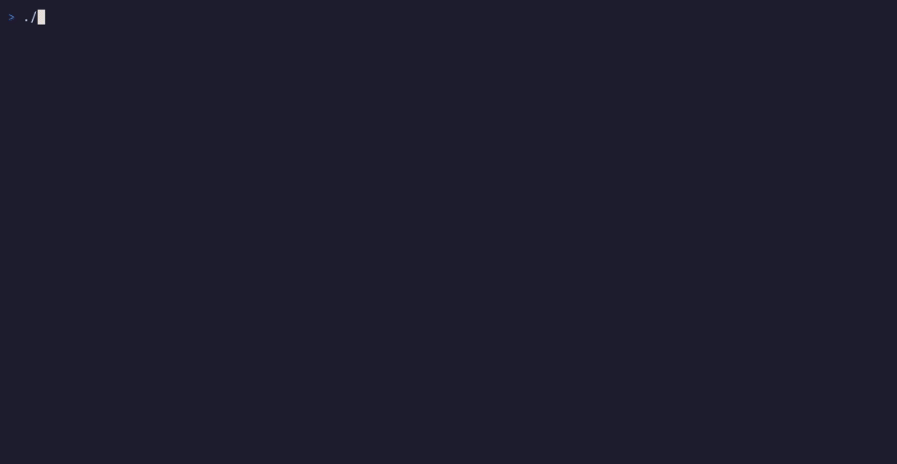

# lazybus

A lazygit-style terminal UI for **Azure Service Bus** dead-letter queues, built for the on-call moment: open the dead-letter queue, look at the first message, fix it, put it back.



Why another Service Bus tool: the existing ones are a desktop app (Service Bus Explorer) or the Azure portal, and neither fits a terminal over SSH at 3 a.m. lazybus does one job, **DLQ Repair**: it moves a dead-lettered message back to its queue (or to the parent topic of its subscription), optionally with edited properties or body, without the dead-letter markers, and it never holds a lock on a message outside that one call. Browsing is peek-only.

**Status:** pre-release; v0.1.0 is not tagged yet. See [`CHANGELOG.md`](CHANGELOG.md), [`docs/spec.md`](docs/spec.md) for the design and [`GLOSSARY.md`](GLOSSARY.md) for the vocabulary.

## Install

With Go 1.26 or newer:

```sh
go install github.com/samuelstrom93/lazybus/cmd/lazybus@latest
```

Or download a release archive (Linux and macOS, amd64 and arm64) from [GitHub Releases](https://github.com/samuelstrom93/lazybus/releases), check it against `checksums.txt`, and put `lazybus` on your `PATH`. The binaries are static (no cgo).

```sh
lazybus --version
```

## Quick start

```sh
lazybus --demo                                           # built-in demo data, no Azure

az login
lazybus                                                  # discover namespaces from az login
lazybus --namespace sb-prod-weu                          # one namespace, az login credential, no discovery
lazybus --connection-string 'Endpoint=sb://…;SharedAccessKeyName=…;SharedAccessKey=…'
lazybus --emulator                                       # local emulator, ports 5672 / 5300
lazybus --read-only --namespace sb-prod-weu              # browse and peek only
lazybus --connection-string "$CS" --entity orders --entity order-events/billing
                                                         # only these entities: no Manage rights needed
```

In lazybus, press `?` for the keybindings and `q` to quit. In the demo: `2` focuses Entities, `j`/`k` and `enter` open `orders`, `3` focuses its dead-letter messages, `r` resubmits the selected message and `y` confirms.

| Flag | Meaning |
|---|---|
| `--namespace <fqdn>` | Open this namespace with the Azure CLI credential (`az login`) and skip discovery. A bare name gets `.servicebus.windows.net` appended. |
| `--connection-string <cs>` | Open the namespace of a SAS connection string. Also read from `LAZYBUS_CONNECTION_STRING`; the flag wins. |
| `--emulator` | Open the local Service Bus emulator on `localhost` with its development connection string. |
| `--emulator-amqp-port <n>` | Emulator AMQP port (default 5672). |
| `--emulator-admin-port <n>` | Emulator admin HTTP port (default 5300). Also used for a `--connection-string` with `UseDevelopmentEmulator=true`. |
| `--entity <path>` | Open this entity instead of listing the namespace's entities, which needs Manage rights: a queue name, or `topic/subscription`. Repeatable. Needs exactly one of `--connection-string`, `--namespace` or `--emulator`; skips discovery. |
| `--read-only` | Disable every state-changing key (`r`, `c`). Edits still work: they only change lazybus's memory. |
| `--demo` | Run against built-in demo data. |
| `--version` | Print the version and exit. |
| `--help` | Print usage and examples. |

### Permissions

Discovered namespaces and `--namespace` open with the Azure CLI credential, so your account needs a Service Bus data-plane role on them: **Azure Service Bus Data Owner** covers listing, peeking and resubmitting. Listing a namespace's entities needs **Manage** rights; without them (for example a SAS rule with Listen and Send) the Entities panel says `listing needs Manage rights (HTTP 401); open entities with --entity <queue|topic/subscription>`. With `--entity` lazybus opens those entities without listing: peek needs Listen, resubmit Listen and Send. Their counts show `?` when the credential can't read them. A resubmit can't read the target either, so it assumes duplicate detection and gives the copy a new MessageId by default (the confirm popup says so; `m` keeps the original), and it can't count a topic's subscriptions. A rejected credential shows as `unauthorized` in the panel and the log.

### Discovery

Without `--namespace`, `--entity` or `--demo`, lazybus discovers namespaces with the Azure CLI credential: it lists the enabled subscriptions you can read, then each subscription's Service Bus namespaces (four at a time). A subscription shows `loading <name>…` until its list arrives; one that fails shows `<name>: error`, with the error in the log, and the others still load. `--connection-string` and `--emulator` add their namespace on top of the discovered ones and open first; a discovered namespace never opens until you press `enter` on it. With Namespaces focused, the main pane shows the selected namespace's subscription, resource group, SKU, location and auth. A Basic-tier namespace has no topics: its queues list, and the topics error goes to the log.

Entities show their active and dead-letter counts (`act 120 DLQ 37`; the active count gives way when the paths need the room). On the emulator they show `?`: its admin API does not report runtime counts.

### Messages

The Messages panel peeks messages, 50 at a time, on two tabs: **DLQ** and **Active** (`tab` switches when Messages is focused). Moving onto the last row loads the next 50. On a partitioned entity messages come in enqueue order across partitions, not by sequence number; paging still returns each message once. The Active tab shows the subject instead of the dead-letter reason and is read-only. On a sessionful entity it says so instead of listing: peeking active messages needs a session lock, which v0.1 does not take; the DLQ tab works. The DLQ of an entity with `ForwardDeadLetteredMessagesTo` can't be peeked (Azure refuses with `amqp:not-allowed`); it is always empty, since its dead letters go to the forward target.

Every broker call times out after 30 s (a resubmit and its pre-check, which are several calls each, after 2 min); errors show in the panel and the log.

## Keys

### Navigation

| Key | Where | Action |
|---|---|---|
| `1` `2` `3` / `0` | anywhere | Focus Namespaces, Entities, Messages / the main pane. |
| `j` `k` / `enter` | a panel | Move / open the selected namespace or entity. |
| `h` `l` | anywhere | Previous / next panel. |
| `g` `G` / `ctrl-d` `ctrl-u` | a list | Top, bottom / half page down, up. |
| `[` `]` | anywhere | Previous / next main-pane tab: Body, Properties, System. |
| `/` | a side panel | Filter the list as you type: a case-insensitive match on the visible columns. The filter shows in the panel title. `enter` keeps it and returns to the list; `esc` (while typing, or on the panel) clears it. It is dropped when the list changes source (another namespace, entity or tab). |
| `:` | anywhere | Jump to an entity of the open namespace by fuzzy name; `enter` opens its DLQ. |
| `s` | Entities | Sort by path, or by DLQ count (largest first; `?` counts last). |
| `R` | the focused panel | Refresh: Namespaces discovers again, Entities lists again (with counts), Messages and the main pane peek again from the start. The cursor keeps its entity, or its message row index. |
| `y` | main pane tabs, Namespaces | Copy the body (Body tab), the selected property's value (Properties) or field (System); on Namespaces, the FQDN. `j`/`k` move the row cursor on Properties and System when the main pane is focused. |
| `Y` | anywhere | Copy the selected message's MessageId. |
| `?` / `q` | anywhere | Keybindings menu (searchable) / quit. |

The status bar confirms each copy (`copied …`). Copy uses OSC 52, so it reaches your local clipboard over SSH when the terminal supports it. Inside tmux, lazybus runs `tmux load-buffer -w -`, which works with tmux's default settings (tmux 3.2 or newer) and sets the tmux buffer too; if that fails it falls back to an OSC 52 sequence wrapped for tmux passthrough, which needs `set -g allow-passthrough on`. The body is copied as stored (raw bytes, not the pretty-printed view).

### Resubmit (DLQ Repair)

| Key | Where | Action |
|---|---|---|
| `r` | Messages, main pane (DLQ tab) | Resubmit the selected message: checks it is still there, then opens a confirm popup. |
| `y` | confirm popup | Confirm. Only `y` confirms; `enter` does nothing here. (Outside a popup `y` copies.) |
| `n` / `esc` | confirm popup | Cancel. Every other key is ignored: nothing happens until you confirm. |
| `m` | resubmit popup | Toggle the copy's MessageId between the original and a new one. |
| `c` | Messages, main pane | Finish Cleanup on a CleanupPending row (confirm popup; nothing is sent). |

After a successful resubmit the cursor stays on the same row, which now holds the next message, so `r y r y …` works down the list. `--read-only` disables `r` and `c`. The Active tab is read-only. While a resubmit or cleanup runs, keys wait, and `ctrl-c` and a closed terminal (SIGHUP) do not quit; `kill` (SIGTERM) quits once the outcome is logged, prints it to stderr, and exits 1 if the message did not get through. Its outcome is never lost.

### Edit before resubmit

Edits are made on the DLQ tab and kept as **Pending Edits** of that message until you resubmit it. The copy carries them; the dead-lettered message itself is never changed. On the Active tab the edit keys are refused.

| Key | Where | Action |
|---|---|---|
| `e` | Properties tab | Edit the selected property (the popup is prefilled). |
| `a` | Properties tab | Add a property. |
| `e` | Messages | Add a property to the selected message. |
| `d` | Properties tab | Remove the selected property from the copy; `d` again keeps it. |
| `e` | System tab | Edit Subject or ContentType (the rows marked ✎). An empty value leaves the field unset on the copy. |
| `E` | Messages, Body tab | Edit the body in `$VISUAL`, then `$EDITOR`, then `vi`. |
| `x` | Messages, main pane | Discard all Pending Edits of the selected message (confirm with `y`). |
| `enter` / `tab` / `esc` | property popup | Save / next field (`shift+tab` previous) / cancel. On the Type field `←` `→` pick the type. |

The property popup has Key, Type and Value. Types are String, Int (32-bit), Long (64-bit), Double, Bool (`true`/`false`), Guid and DateTime (RFC 3339, e.g. `2026-09-18T22:15:00Z`); the copy sends each with its AMQP type. A new key starts as String; an existing key keeps its type unless you pick another. An invalid value keeps the popup open with the error. `DeadLetterReason` and `DeadLetterErrorDescription` are never edited: they are removed on resubmit anyway.

Pending Edits show inline: `*` changed (with the old value), `+` added, `−` removed; the Body tab says `(edited)`, and the options bar shows `✎ N pending` (messages with Pending Edits).

The body goes to a temp file (mode 0600, in the system temp directory, removed afterwards). A JSON body (by ContentType, or because it parses as JSON) opens pretty-printed, and the copy is sent with the bytes as you saved them, not re-compacted. If you save JSON that does not parse, it is kept as the Pending Edit and flagged in the Body tab and the confirm popup. `E` again opens the pending body. Saving the file unchanged adds no edit; one trailing newline added by the editor is dropped.

Pending Edits live in memory only: **they are lost when lazybus quits.** A resubmit that does not go through (LockLost, SendFailed, SendUncertain) keeps them for the retry, and so does CleanupPending; they are dropped when the message is Resubmitted, cleaned up, or found gone by the pre-check. On a SendUncertain or CleanupPending row they can no longer be changed or discarded: a SendUncertain retry reuses the MessageId, so it must send exactly what the first attempt sent.

## Safety model

- **No held locks.** Browsing is peek, which never locks a message and never changes it. lazybus takes locks only inside a resubmit call, and every lock is released before that call returns.
- **A resubmit is a move:** send a copy, then delete the original. Nothing is retried behind your back, and an unclear result is shown as unclear.
- **Read-only mode.** `--read-only` turns off `r` and `c`, the only keys that change broker state.

A resubmit runs these steps:

1. **Pre-check.** Peek the message by its sequence number, without a lock. If it is gone, the row is removed and nothing is touched. A message whose AMQP body is not a single data section (an AMQP value or sequence body) or whose message-id is not a string is refused, because the copy would lose data.
2. **Confirm.** The popup lists the source and target (a queue's DLQ goes back to that queue; a subscription's DLQ goes to its parent topic), the body, every Pending Edit as a diff, the dead-letter markers that are removed, the MessageId, the scan cost and target warnings: a topic delivers only to subscriptions whose rules match (no match means the copy is dropped), and a topic with no subscriptions is refused. It defaults to cancel.
3. **By-sequence scan.** Service Bus cannot receive one message by sequence number, so lazybus opens a peek-lock receiver for this one call and receives the DLQ until it finds the message. The messages ahead of it, and the rest of the batch it arrived in, stay locked until the scan ends; then all are abandoned at once. **That is the cost of the scan:** for the length of the call (about a second) those messages are invisible to other DLQ receivers. Their DeliveryCount does not change: a dead-letter queue does not count deliveries (verified on a Standard namespace and the emulator; Premium not checked). The scan locks at most the row's position plus 50 messages and stops well before the first lock expires. Before closing the receiver it waits 500 ms, so messages already on their way back over the link are released too, not left locked until their lock expires (measured on Azure: without the wait, 3 of 15 abandoned messages stayed locked).
4. **Send, then complete.** The copy keeps the body, application properties (with their types) and the copied system fields, with the message's Pending Edits applied; `DeadLetterReason` and `DeadLetterErrorDescription` are removed. On a target with duplicate detection the copy gets a new MessageId by default (`m` toggles), because a copy with the original id inside the detection window is dropped as a duplicate while the original is still deleted: the message would be lost.

Every outcome is shown in the status bar, and every broker call that changes state goes to the log:

| Outcome | Meaning | Row |
|---|---|---|
| Resubmitted | The copy is in the target and the original is gone. | Removed. |
| NotFound | The message was already gone (pre-check), or the scan stopped before reaching it; nothing sent. | Removed when gone; kept when the scan stopped, since it may still be in the DLQ. |
| LockLost | The lock (or the call's time) ran out before the send; nothing changed. | Kept; `r` retries. |
| SendFailed | The target rejected the copy (for example, no Send right); nothing changed. | Kept; `r` retries. |
| SendUncertain | The send ended without a clear answer: the copy may or may not be in the target. Never retried automatically. | Amber. `r` is allowed after you check the target; the retry reuses the same MessageId, so a target with duplicate detection drops a second copy. |
| CleanupPending | The copy is in the target but deleting the original failed. Never reported as success. | Red. `r` is blocked; **Finish Cleanup** (`c`) removes the original without sending anything. |

A message that Azure auto-forwarded from another entity's dead letters (`ForwardDeadLetteredMessagesTo`) carries `DeadLetterSource`; lazybus still resubmits it to the entity you opened, not to the source.

## Development

Install the git hooks once per clone:

```sh
./scripts/install-hooks.sh
```

- `pre-commit`: `gofmt -l .` must be empty, `go vet ./...`.
- `pre-push`: `go test ./...` (unit tests and golden screens), `staticcheck ./...` if installed, `go build ./...`. Skipped for a push that only changes `benchmarks/release/` (the snapshot commit of a release).

Golden screens live in `internal/ui/testdata/*.golden`. Regenerate them after an intended UI change and inspect the diff before committing:

```sh
go test ./internal/ui -update
```

Render all goldens into one HTML page:

```sh
go run ./tools/gallery -out <dir>
```

### Local Service Bus emulator

`emulator/` holds a Docker Compose setup for the Azure Service Bus emulator with lazybus' test entities. It maps the emulator to non-default host ports so it can run next to another emulator: AMQP on **5682**, admin/health HTTP on **5310**.

```sh
cd emulator && cp .env.example .env && docker compose up -d
```

Seed it with dead-lettered messages (JSON and plain-text bodies with typed application properties in `orders/$DLQ` and `order-events/billing/$DLQ`, one message in `orders-dedup/$DLQ` (a queue with duplicate detection), plus the subscription-less topic `empty-topic`), then open it:

```sh
go run ./tools/seed          # drains the seeded DLQs first; -reset=false appends
go run ./cmd/lazybus --emulator --emulator-amqp-port 5682 --emulator-admin-port 5310
```

The seeder refuses connection strings without `UseDevelopmentEmulator=true`. Runtime entities such as `empty-topic` vanish when the emulator restarts; rerun the seeder.

### End-to-end tests

Neither suite runs in the hooks. Run them by hand.

Emulator (against the running emulator; it seeds it first; ports override with `LAZYBUS_EMULATOR_AMQP_PORT` / `LAZYBUS_EMULATOR_ADMIN_PORT`):

```sh
go test -tags emulator ./...
```

Real namespace (skipped unless `LAZYBUS_AZURE_NAMESPACE` is set):

```sh
az login
LAZYBUS_AZURE_NAMESPACE=<ns>.servicebus.windows.net go test -tags azure ./...
```

It uses the Azure CLI credential, which needs Azure Service Bus Data Owner on the namespace. It creates the entities it needs when they are missing (all named `lazybus-e2e-*`, kept between runs), drains them, and touches nothing else. It also sets a Listen-only SAS rule `lazybus-e2e-listen` on `lazybus-e2e-q` with a random key that is never stored. A run takes about 2 minutes. What it verifies, with numbers, is in [`docs/spike-s-1.md`](docs/spike-s-1.md) (S4 section).

### Release check

```sh
goreleaser check
goreleaser release --snapshot --clean   # builds the archives into dist/, publishes nothing
vhs docs/demo.tape                      # re-records docs/demo.gif from --demo
./scripts/release.sh vX.Y.Z --dry-run   # measures and compares the release benchmarks, tags nothing
```

A release is an annotated `vX.Y.Z` tag on `origin/main`, made by `./scripts/release.sh vX.Y.Z` on framen; the tag runs `.github/workflows/release.yml`, which gates on the benchmark snapshot and publishes the GitHub release. Merging to main ships nothing. Details, benchmarks and thresholds: [`docs/releasing.md`](docs/releasing.md).

## License

Dual-licensed under either of [MIT](LICENSE-MIT) or [Apache-2.0](LICENSE-APACHE), at your option.
